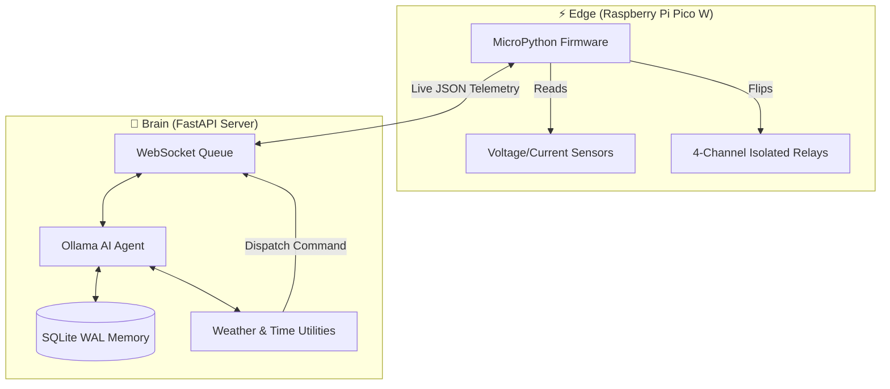

<div align="center">

# ☀️ Smart Solar PCU

### *The Unnecessarily Intelligent Power Switch*

An intelligent solar power conditioning unit with an **autonomous AI agent** that reasons, plans, and learns to optimize your solar power usage, because manually flipping relays is *so* last century.

---

**Part of the *Over Engineered by Venky* Series**

> *Welcome to "Over Engineered by Venky", a growing collection of projects where the solution is gloriously, unapologetically disproportionate to the problem. Need to switch to solar power? Sure, a simple voltage-based relay would work. But why not deploy a Pico W, a Python backend with SQLite, an event-driven FastAPI server, and an Ollama-powered AI agent that maintains beliefs, plans actions, and reflects on its past decisions? Every project in this series exists because "but I could automate that with AI" is a lifestyle, not a suggestion. Efficiency? Optional. Style points? Mandatory.*

---

[](#)
[](#)
[](https://micropython.org/)
[](https://www.raspberrypi.com/products/raspberry-pi-pico/)
[](https://ollama.com/)

</div>

---

## 📖 Background

The journey started back in 2019 with a goal to install a rooftop solar unit. After consulting with multiple companies and getting quotes for 2kW-5kW on-grid systems, the society board unfortunately denied permission. Fast forward to the scorching summer of 2022, facing an unprecedented combo of heat and power cuts, the idea was resurrected—this time as a DIY off-grid setup.

**This is not just a weekend Proof-of-Concept.** The core hardware has been running continuously since mid-2022. Based on historical data, the panels generate ~0.9 units (kWh) per perfectly sunny day during Mumbai's 8 clear months, and a conservative ~0.35 units during the 4 months of heavy monsoon. This equates to roughly 266 units annually. Over the last ~3.8 years, this tiny Over-Engineered setup has reliably produced **over 1,000+ kWh of pure off-grid solar energy**, meaning the entire hardware BOM has already paid for itself in grid electricity savings!

**The Evolution:** Like all good Over-Engineered projects, this didn't start its life with an AI brain. The first version relied on a humble Arduino Uno R3 executing rigid `if/else` voltage rules. Last year, the system was completely gutted and upgraded to the Raspberry Pi Pico W, enabling high-frequency telemetry streaming over WebSockets, paving the way for the Agentic AI integration that now actively learns, predicts outages, and makes autonomous decisions.

---

## 🆚 The Problem vs. The Over-Engineered Solution

**The Normal Solution:** Drop ₹500 on a generic voltage-sensing relay that switches from solar to grid at 11.5V. It’s dumb, it bounces during heavy loads, it has zero context about the outside world, and it routinely ruins your battery by deep discharging it on cloudy days.

**The Venky Solution:** Deploy a Raspberry Pi Pico W that streams high-frequency JSON telemetry over WebSockets to a FastAPI server with an asynchronous event loop. This server queries a local Large Language Model (like `llama3.1` via Ollama). The LLM cross-references the live telemetry with OpenWeather API forecasts and sunset algorithms to fundamentally "think" and safely execute a Python tool to engage a 4-channel Break-Before-Make isolated transfer switch. 

Because why use a simple comparator IC when you can use billions of parameters of neural networks?

---

## 🏗️ Edge-to-Cloud Architecture

The system is physically divided between the "dumb" Edge hardware and the highly intelligent Local Server.



---

## 🤖 The Autonomous AI Agent

Unlike a Python script with endless `if/else` statements, the Agent operates on a continuous **OODA Loop (Observe, Orient, Decide, Act)** modified for solar management:

### 1. Perception & Beliefs
The agent constantly receives telemetry (voltage, current, Grid status). It maintains a "Belief State"—a structured understanding of reality. For example, it knows if it's currently dark outside, if a storm is coming (via API), and if the battery is draining faster than usual.

### 2. Reasoning & Planning
Armed with its beliefs and primary goals (Maximize Solar, Protect Battery), the LLM reasons about what to do. If it predicts that the 40Ah battery won't survive the night based on current cloudy conditions, it generates a multi-step plan to conserve energy.

### 3. Action (Tool Calling)
The LLM executes its plan by calling registered Python functions (Tools), such as `switch_power_source("GRID")` or `set_soc_target(85)`. These commands are dispatched back to the Pico W.

### 4. Continuous Reflection
*This is the coolest part.* 
The AI literally reads its own past decisions from the SQLite database, analyzes the outcomes, and **grades itself**. 
*Example: "I switched to Solar at 5 PM, but it got dark 30 mins later and I drained the battery to critical levels. I should not switch to Solar this late in the day. Updating internal patterns."*

## 📸 Hardware Showcase

<div align="center">


*The 165W Solar Panels doing their job.*


*The 12V 40Ah Lead-Acid Battery acting as energy storage.*


*The original v1 setup featuring the Arduino Uno R3, the 4-Channel Relay board, and the heavy-duty AC/DC breakers.*

</div>

---

## 🎯 Key Features

### 🧠 Agentic AI-Powered Lead-Acid BMS
While Lithium batteries have sophisticated built-in Battery Management Systems (BMS), traditional Lead-Acid batteries are notoriously "dumb." The Agent steps in to act as a **Hyper-Intelligent BMS** for the old-school 40Ah Lead-Acid chemistry:
- **Dynamic SOC Estimation**: Estimates State of Charge not just on raw voltage, but by learning voltage sag under different loads over time.
- **Predictive Health Conservation**: Prevents damaging deep discharges during cloudy days by querying the weather forecast and pre-emptively switching to the grid *before* the battery drains.
- **Adaptive Charging**: Automatically adjusts its target reserves based on seasons and sunlight availability to prevent sulfation.
- **Panel Maintenance Tracking**: Continuously monitors the all-time peak solar power versus recent daily peaks to detect slow efficiency degradation, automatically sending alerts when the panels need cleaning.

### 🔄 Intelligent Switching Scenarios
- **Emergency Detection**: Critical battery → immediate grid switch.
- **Night Mode**: Sunset approaching → preserve battery for night backup.
- **Surplus Utilization**: Battery full + sun → aggressively use solar.

---

## � Bill of Materials (BOM)

| # | Component | Specs | Qty | Approx. Price (₹) | Notes |
|---|---|---|---|---|---|
| 1 | Raspberry Pi Pico W | RP2040, Wi-Fi | 1 | ₹600 | The brains of the operation |
| 2 | Solar Panels (165W 12V) | Poly-crystalline | 2 | ₹11,600 | Power generation (Microtek/Luminous) |
| 3 | Battery | 12V 40Ah C10 Lead-Acid | 1 | ₹4,199 | Energy storage for backup / night |
| 4 | Luminous 1220NM | Solar Charge Controller | 1 | ₹689 | Regulates charging from panels |
| 5 | Portronics CarPower One | 150W Modified Sine Wave | 1 | ₹2,599 | Efficient DC-AC conversion |
| 6 | 4-Channel Relay Module | 5V logic, opto-isolated | 1 | ₹169 | Switches between Grid and Solar |
| 7 | DC-DC Buck Converter | 4.5-40V to 5V Step Down | 1 | ₹249 | Powers Pico W and relays |
| 8 | Sensors | Voltage dividers, Current, AC | Assorted | ₹500 | Telemetry gathering |
| 9 | DC/AC Breakers & Boxes | 16A/25A MCBs | Assorted | ₹1,700 | Safety and isolation |
| 10 | Cables & Connectors | 4sqmm DC, MC4, Lugs | Assorted | ₹1,500 | Wiring everything up |

**Total estimated cost: ~₹23,805** *(A fraction of commercial hybrid quotes!)*

---

## ⚡ Wiring Schematic

See `hardware/schematic.md` for detailed wiring diagrams showing how to interface the 4-channel relay with the Grid, Inverter, and load, maintaining proper galvanic isolation with safe **Break-Before-Make** logic.

---

## 🚀 Quick Start

### 1. Server Setup

```bash
cd server
pip install -r requirements.txt

# Configure environment
cp .env.example .env
# Edit .env with your settings (Ollama URL, Weather API Key, Location)

# Run agentic server
python main.py
```

### 2. Pico W Firmware

Edit WiFi credentials and server URL in `firmware/config.py`.

```bash
# Flash agent client firmware
mpremote cp firmware/config.py :config.py
mpremote cp firmware/pico_client.py :main.py
```

### 3. Test the Agent (Simulation)

```bash
# Simulate a storm condition to watch the AI panic and switch to Grid
curl -X POST "http://localhost:8000/api/simulate/telemetry?scenario=storm" \
  -H "X-API-Key: your-key"
```

---

## 📝 Logs & Debugging: Inside the AI's Mind

Because this is an AI agent, you don't just get `[INFO] Relay Switched`. You get the exact reasoning trace logged in real-time. Here's what goes through its head during a storm warning:

```text
[AGENT] PERCEIVE: Battery at 55%, Panel at 17V, Grid Available. Time is 6:30 PM.
[AGENT] BELIEFS: Thunderstorm predicted. 1.5 hours to sunset. High outage risk (0.7).
[AGENT] REASONING: Situation detected - High outage risk with moderate battery. I need to conserve the battery for the predicted outage.
[AGENT] INTENTION: Priority 9 - Conserve battery. Priority 8 - Ensure backup reliability.
[AGENT] PLAN: [switch_power_source("GRID"), set_soc_target(85)]
[AGENT] ACTION: Dispaching TOOL switch_power_source(Grid) -> SUCCESS
[AGENT] REFLECTION: Action successful. Memory updated: Incoming storm → aggressively conserve battery early.
```

---

## 🔒 Safety Features

> [!CAUTION]
> **High Voltage Warning & Disclaimer**
> This project involves mains AC voltage (230V) and high-current DC. The actual physical deployment utilizes strictly rated 4 sq.mm DC wires, heavy-duty AC/DC breakers, inline fuses, and proper galvanic isolation. If you attempt to replicate this, you **MUST** use appropriately gauged wires, over-current protection, and standard electrical safety practices. **Replicate entirely at your own risk.**

1. **Break-Before-Make**: Firmware physically guarantees a 500ms separation between Grid and Inverter, preventing catastrophic shorts.
2. **Rate Limiting**: Max 10 switches per hour to protect appliance compressors and relays.
3. **Emergency Override**: If battery plummets critically, firmware ignores the AI and forces a grid switch.
4. **Local Fallback**: Works locally without constant internet if the AI goes offline.

---

## 📄 License

**CC BY-NC 4.0 (Creative Commons Attribution-NonCommercial 4.0 International)**: 
This project is licensed under the CC BY-NC 4.0 License. It is free for personal, educational, and hobbyist use. Commercial use, including selling the software, hardware design, or using it in a commercial product, is strictly prohibited. See the `LICENSE` file or [http://creativecommons.org/licenses/by-nc/4.0/](http://creativecommons.org/licenses/by-nc/4.0/) for full details.

Use at your own risk. **High voltage AC and DC involved. Built for Over-Engineering purposes.**

---

<div align="center">

**Over Engineered with 💚 by Venky**

*Because if it's worth doing, it's worth over-doing.*

</div>
